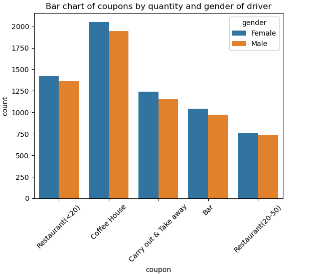
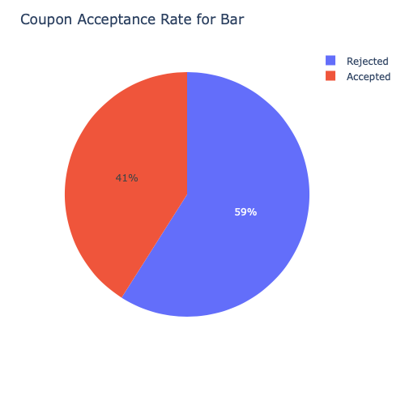
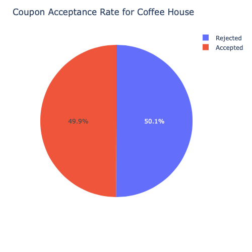

# Will the Customer Accept the Coupon?

This is a brief report that highlights differences between customers who did and did not accept the coupons. My exploration of this data set using  my knowledge of plotting, statistical summaries and visualization using python.

## Let's get started

Jupyter notebook: [prompt.ipynb](prompt.ipynb)

Data source: UCI Machine Learning repository

The survey describes different driving scenarios including the destination, current time, weather, passenger, etc., and then ask the person whether he will accept the coupon if he is the driver. Answers that the user will drive there ‘right away’ or ‘later before the coupon expires’ are labeled as ‘Y = 1’ and answers ‘no, I do not want the coupon’ are labeled as ‘Y = 0’. There are five different types of coupons -- less expensive restaurants (under $20), coffee houses, carry out & take away, bar, and more expensive restaurants ($20 - $50).

## High level analysis
Looking at the notebook you can see the acceptance rate for all coupon types are **~56%**. So that is the probability that the user will drive right away or later before the coupon expires. Now let us look at how the coupons are distributed by type and gender of the driver

As you can see above the distribution of the coupons by location and gender, it give you an idea that most coupons are 'Restaurant <20' or Coffee House

## Investigating Bar Coupons

Acceptance rate of bar coupons

**41%** accepted the bar coupons and from analysis done in the notebook, we can see that:

- **80%** of the people that accepted the Bar coupon goes 3 or fewer times while **18.5%** goes more than 3 times
- **14.4%** of the total who got Bar coupon is over the age of 25 and goes to bar more than once a month Which makes up for **35%** of those who accepted the coupon
- Drivers who go to bars more than once a month and had passengers that were not a kid and had occupations other than farming, fishing, or forestry make up **19%** of total population with Bar coupon which is **47%** of them who accepted the coupon 
- Out of the total users with bar coupon, **19%** go to bars more than once a month, had passengers that were not a kid, and were not widowed **12%** Go to bars more than once a month and are under the age of 30, **7.7%** Go to cheap restaurants more than 4 times a month and income is less than 50K.

## Investigating Coffee Coupons
Acceptance rate for coffee coupons

**49%** of those with a coffee coupon accepted and additional analysis shows that:
- 10% of people that accepted the coupon are heading to work
- Out of all who got the coffee coupon 8.65% of them that accepted it are heading to work on a sunny day and this makes up 17.3% that accepted it
- We can also see that a significant number of people accepted coffee coupon on a sunny day over any other weather
- 50.6% of those that acceped the coupon are females while 49.4% male.
